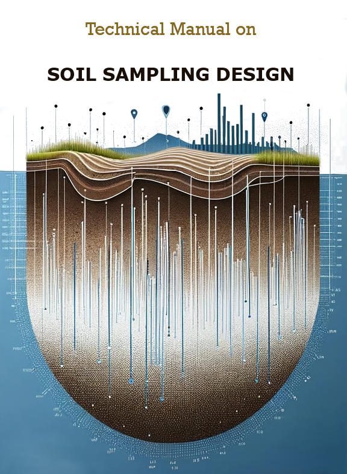

--- 
title:  |
  
  Soil Sampling Design
subtitle: "Technical Manual"
author: "Rodríguez Lado, L., Angelini,  M.E, Naypewe, N., Luotto, I., Yigini, Y."
date: "`r Sys.Date()`"
site: bookdown::bookdown_site
documentclass: book
bibliography: [references.bib]
biblio-style: apalike
link-citations: yes
description: "Technical Manual on Soil Sampling Design within the SoilFer Project."
header-includes:
    - \AtBeginDocument{\renewcommand{\chaptername}{Chapter}}
    - \usepackage{titling}
    - \usepackage{natbib}
    - \usepackage{pdfpages}
    - \usepackage{fancyhdr}
    - \usepackage{booktabs}
    - \usepackage{longtable}
    - \usepackage{subfig}
    - \usepackage{array}
    - \usepackage{amsmath}
    - \usepackage{multirow}
    - \usepackage{wrapfig}
    - \usepackage{bookmark}
    - \usepackage[utf8]{inputenc}
    - \usepackage{float}
    - \usepackage{colortbl}
    - \usepackage{pdflscape}
    - \usepackage{tabu}
    - \usepackage{threeparttable}
    - \usepackage{threeparttablex}
    - \usepackage[normalem]{ulem}
    - \usepackage{makecell}
    - \usepackage{xcolor}
    - \DeclareUnicodeCharacter{2212}{\textendash}
    - \usepackage{rotating, graphicx}
    - \usepackage{listings}
classoption: oneside
papersize: b5
fontsize: 10pt
always_allow_html: yes
template: null
csl: food-and-agriculture-organization-of-the-united-nations.csl
---


```{r set-options, echo=FALSE, cache=FALSE, warning=FALSE, message=FALSE, eval = FALSE}

options(width = 65 ,scipen=999)

library(kableExtra)

# Cache results
knitr::opts_chunk$set(cache=F,fig.pos = 'H', fig.cap = T,dev = 'jpeg')

```


\frontmatter
\addtocontents{toc}{\protect\hypersetup{hidelinks}}   
\addtocontents{lof}{\protect\hypersetup{hidelinks}}
\addtocontents{lot}{\protect\hypersetup{hidelinks}}
\addtocontents{lot}{\protect\hypersetup{hidelinks}}
\addtocontents{lot}{\protect\hypersetup{hidelinks}}
\tableofcontents
\listoffigures
\listoftables
\nopagebreak[5]


```{r, echo = F, eval = T, fig.cap = ""}

```

# Licence {-}

This Technical Manual is licensed under the [Creative Commons Attribution-NonCommercial-ShareAlike 4.0 International License](https://creativecommons.org/licenses/by-nc-sa/4.0/).

[CC BY-NC-SA 4.0 LEGAL CODE](https://creativecommons.org/licenses/by-nc-sa/4.0/legalcode.en).


# Abbreviations and acronyms {-}

CRAN

:   Comprehensive R archive network

DSM

:   Digital soil mapping 

GEE

:   Google Earth Engine

GIS

:   Geographic Information Systems

GSP

:   Global Soil Partnership

INSII

:   International Network of Soil Information Institutions

ITPS

:   Intergovernmental Technical Panel on Soils
